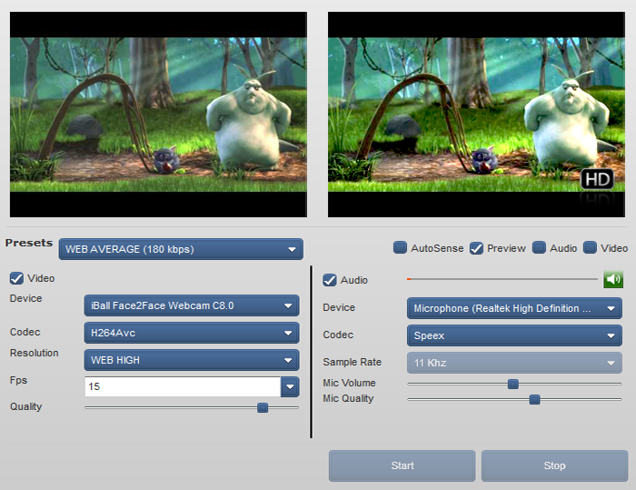

# HDBroadcaster

Flex based RTMP publisher software

Web Media Live Encoder HD is a innovatory product which works with any RTMP or RTMFP server, to bring you loads of options and control over your live broadcast. You can choose to broadcast audio only streams, video only streams or both. With a very comprehensive and commercially standardized interface it is the perfect choice for online broadcasting solutions. With the new WMLE HD, you can experience uttermost clarity or a picture perfect broadcast. Dont believe us ? Then try for yourself and decide for yourself.

## Feature List:

* Broadcast in audio/video modes
* Advanced echo cancellation features as of Flash player 10.3
* Supports FLV and MP4 formats
* Supports Sorenson and H264AVC video codecs - Flash player 11 ready!!
* Professional UI
* Compatible with FMS,Red5 and Wowza
* Generates preview image of recording without ffmpeg
* Generates recording duration without flvTools if used for live-record
* Includes a comprehensive Javascript api
* Auto capture camera snapshot image at regular intervals to show at site
* Choose to show/hide RTMP url from application user.
* Built upon Adobe Cairngorm micro-architecture
* Compatible with DVR type broadcast on FMS.
* Multiple encoding options
* Presets for easy quality selection
* Speex and Nellymoser  audio codec support
* Allow/Disallow video/sound preview
* Amf-php based php integration for fastest server response and standalone operation
* RTMFP support with free P2P player for server-less broadcasting
* Auto reconnection on network failure

## Server side requirements

* Standard webbsserver required
* No special server side application needed

> Works with Red5 open source, Red5 pro, Wozwza, ngnix rtmp mod, and flash media server

## Status

Migrating to 1.5.0
